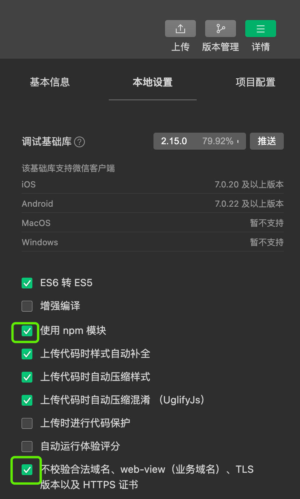
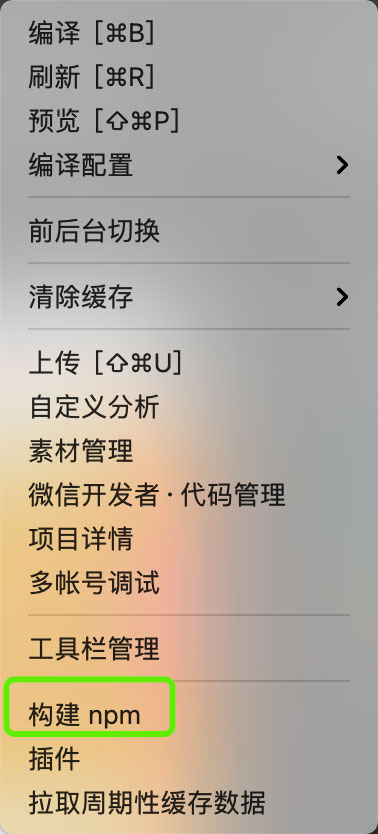

# 企业展示型小程序
    小程序：已开源

    管理后台：暂未开源

体验后台: https://test.yuanxi.ltd/enterprise/console/

用户名：admin

密码：123456

# 截图


# 快速开始

1.在项目根目录执行
```
npm install
```

2.不校验域名, 使用npm模块



3.工具->构建npm



# 案例展示

