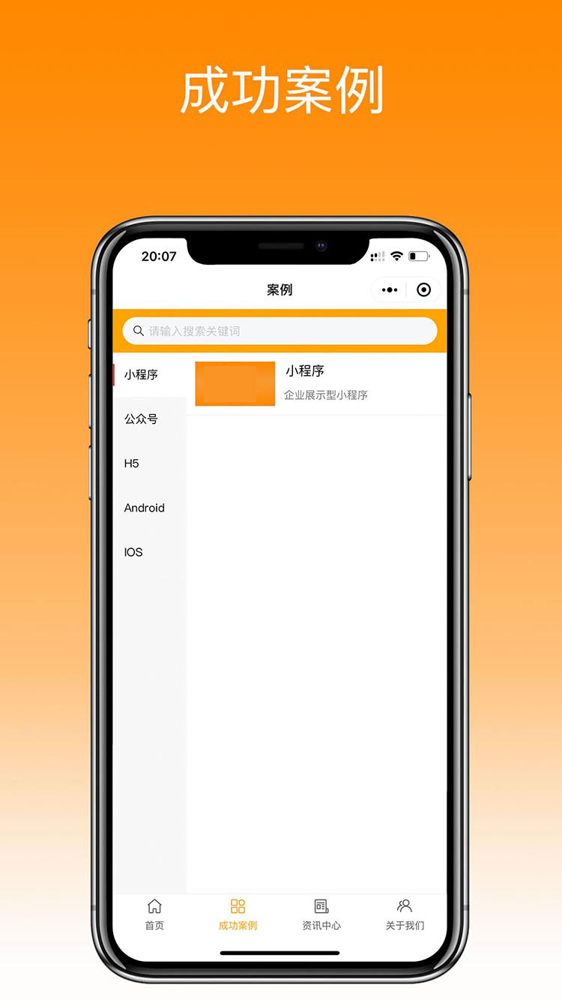
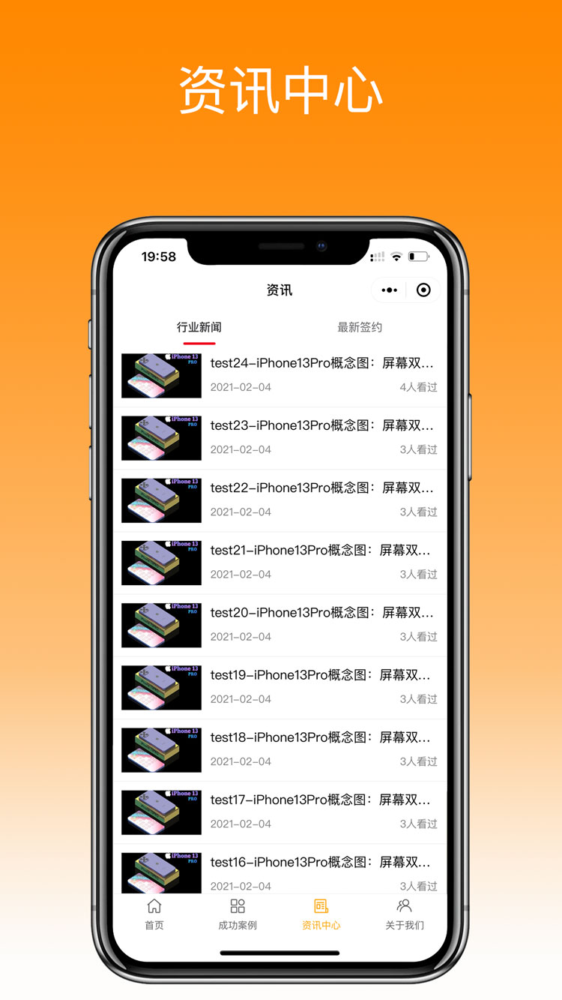

# 企业展示型小程序
- [HBuilderX](https://hx.dcloud.net.cn/)
- [uni-app](https://uniapp.dcloud.net.cn/)
- [Vue3](https://github.com/vuejs/core)
- [uni-ui](https://ext.dcloud.net.cn/plugin?id=55)
- [pinia-plugin-unistorage](https://ext.dcloud.net.cn/plugin?id=8081)
- [Prettier](https://ext.dcloud.net.cn/plugin?id=2025)

如果需要`服务端`或`管理员端`，请移步：https://github.com/chudaozhe/gin-vue-weapp

## 格式化单个文件
```
Ctrl+Shift+F
```

## 配置
1、修改接口前缀
```
vi configs/base.js
...
	baseURL: 'https://ent.uqiantu.com',
```

2、关于我们

这是个单页，并且id是写死的，如果后台修改了，小程序需要同步修改
```
vi pages/page/about.vue
...
  pageHandleDetail(3)
```

## 截图



